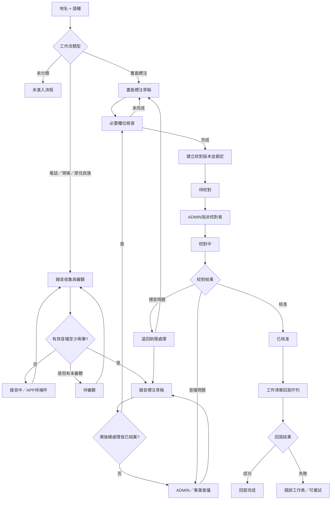

# TopoNote 審查流程重新上架：實作前規劃工作目標書

> ⚠️ **本文件的階段限制已於 2026-08-05 解除，部分內容已被實作取代。**
>
> 本文件是 2026-08-04 凍結的**實作前規劃**。使用者已於 2026-08-05 逐項授權並完成 MVP 實作、部分 Supabase migration 套用與 Apps Script 部署，因此下方第 2 節的「本階段不得修改」限制**已失效**，僅保留作為當時決策背景。
>
> 實作過程中有數處刻意偏離本規劃書，已記錄於 `review-workflow-relaunch-decision-register.md`（D-002、D-003）與 `review-workflow-implementation-gap.md`。**當本文件與實際程式不一致時，以決策登錄與落差對照為準。**
>
> 文件用途：提供新的 session 作為後續工作目標與背景理解。
>
> 盤點基準日：2026-08-04（Asia/Taipei）。

## 1. 工作目標

在不直接修改現有功能的前提下，完成 TopoNote 審查功能重新上架前的完整規劃，包含：

1. 盤點目前 APP、Root GAS、Places GAS、Supabase、衛星表單與 Google Sheet 的實際資料流及函數依賴。
2. 將已確認的業務流程整理成可實作的狀態機、角色權限、資料驗證與錯誤處理規格。
3. 設計「音檔審聽／標音草稿／校對版本／核准回寫」的資料模型。
4. 設計衛星表單與錄音 APP 接入同一校對層的方式。
5. 設計既有資料的重新銜接與舊 MVP 函數的保留、隔離及後續清理策略。
6. 產出可由另一個 Codex session 直接接續執行的實作前規格與驗收條件。

## 2. 本階段的限制（已於 2026-08-05 解除，僅存查）

> 以下限制適用於 2026-08-04 的規劃階段。使用者已在 2026-08-05 的實作 session 中逐項解除授權，本節不再具有拘束力。

本階段不得：

- 修改 `main.js`、`index.html`、`style.css`、Root GAS 或 Places GAS。
- 新增或執行 Supabase migration。
- 修改現有 Google Sheet、欄位、下拉選單或衛星表單內容。
- 停用、刪除、隱藏任何既有函數、資料表或工作表。
- 將現有 MVP 審查函數直接改名後視為新流程完成。

本階段可以：

- 讀取本機程式、migration、文件、測試與 logs。
- 讀取 Supabase live schema、view、RPC、權限與資料統計。
- 讀取 Google Sheet metadata、表頭與必要的資料統計。
- 新增或更新規劃文件，不改變執行中的系統行為。

## 3. 新 Codex session 的第一個工作要求

新的 session 開始時，必須先：

1. 讀取本文件、`AGENTS.md`、`LATEST_HANDOFF.md`、`docs/architecture-inventory.md`、`docs/current-operation-flow.md`。
2. 執行唯讀現況檢查：
   - `git status --short --branch`
   - `git log --oneline -8`
   - 搜尋 APP、Root GAS、Places GAS、Supabase migration 中與審查、標注、assignment、Sheet sync 相關的函數。
3. 重新讀取 live Google Sheet `第三期工作清單` 的 metadata 與表頭。
4. 重新讀取 Supabase `public` schema、view、RPC 定義與 grants；不可只依賴本文件的舊快照。
5. 先提交「現況盤點報告＋差異清單」，等待確認後才進入設計或實作。

## 4. 現況證據摘要

### 4.1 本機專案

| 層級 | 現有位置 | 目前角色 |
|---|---|---|
| 前端 | `index.html`、`main.js`、`style.css`、`config.js` | 靜態 PWA；直接讀取 Supabase view/table，並呼叫 Root GAS |
| Root GAS | `gas/程式碼.js` | Drive 上傳、音檔播放 proxy、Records log、音檔連結、管理功能 wrapper |
| Places GAS | `places-gas/gas/程式碼.js` | 工作清單同步、Users 同步、assignment 回寫、衛星表單 Push/Pull、舊審查回寫入口 |
| Sheet audit | `places-gas/gas/AuditLogger.js` | 人為編輯時更新 `T_UpdatedAt/H_UpdatedAt`；目前不是完整歷程系統 |
| Supabase migrations | `db/` | 現有 task、audio、assignment、舊審查與 Sheet sync 的 schema／view／RPC 記錄 |
| UI tests | `tests/` | 現有登入、assignment、上傳、公告、地名資訊等功能測試；尚無新校對流程測試 |

### 4.2 Live Google Sheet

來源：Places spreadsheet `19zL0Ph0cocqfg5teJu6WKUI8dh_T5y3kSp7MdBQPAcI`，工作表 `第三期工作清單`，`sheetId=364534835`。

- Grid：6843 rows、42 columns、第一列凍結；目前有 6842 筆資料列。
- 已命名表頭目前到 `std_name_code`（AM）；AN:AP 為尚未命名的空白 grid 欄位。
- 目前表頭：

  `UUID, Source, Type, County, Town, Village, HakArea, 經度, 緯度, PlaceName, Info, TaiHan1, TL1, TL2, TL3, TaiNote, TaiClass, HakClass, T_State, T_Annotator, T_CreatedAt, T_UpdatedAt, Honzii, HP1, HP2, HP3, HDialect, HakNote, H_State, H_Annotator, H_CreatedAt, H_UpdatedAt, BatchID, 同步警告, AssignedUsers, AssignmentSyncedAt, location, name_history, std_name_code`

- 目前台語狀態：`待指派` 5292、`待審查` 1432、`尚未標注` 118。
- 目前客語狀態：`待指派` 5482、`待審查` 1299、`尚未標注` 58、空值 3。
- 目前工作流類型仍大量使用 `直接標注`：台語 2128、客語 3094。
- 目前其他工作流類型包含 `電話調查`、`現場調查`、`原住民族`、`未分類`、`N/A`。
- `T_State/H_State`、`T_Annotator/H_Annotator` 是現有 per-language assignment／舊審查欄位，不可直接假設其語意已符合新流程。
- `T_UpdatedAt/H_UpdatedAt` 必須保留；它們目前是最後異動 stamp，不是完整歷程。

### 4.3 Live Supabase

目前主要物件：

- `third_phase_places`：6842 筆工作清單快照。
- `test_places`：10 筆測試資料。
- `final_tasks`：目前 task index；同時保留舊 `moi_placename_raw` 來源資料。
- `audio_records`：目前 1763 筆；台語 1529 筆（1523 active、6 unlinked），客語 233 筆（233 active）。
- `task_language_reviews`：21263 筆；目前主要狀態仍是舊 `待指派`、`尚未標注`、`待審查`，只有 1 筆 `已完成標注`。
- `investigators`：現有登入與使用者資料；目前只有既有 role 模型，尚無完整 `審聽員`／`校對者`權限層。

目前相關 view／RPC 的重要現況：

- `app_tasks_view` 仍以工作清單快照、舊 assignment、未審核音檔數量組合資料。
- `app_review_queue_view` 目前定義為 `WHERE false`，實際回傳 0 筆。
- `app_sheet_sync_queue` 仍是舊 `task_language_reviews.needs_sheet_sync` 的核准回寫模型，但目前沒有待回寫資料。
- `approve_task_language()` 與 `revoke_task_language_review()` 目前都直接拋出「APP review is temporarily disabled」。
- `assign_task_language()`／`unassign_task_language()` 仍可運作，但目前會把 assignment 語意寫進舊 `app_state`，並使用 `assignment_sheet_sync_pending`。
- `task_language_reviews` 現有欄位包含 `app_state`、`reviewed_by`、`reviewed_at`、`final_fields`、assignment 欄位與兩種 Sheet sync flag；沒有新流程所需的版本、草稿鎖定、音檔關聯判定、校對退回歷程與回寫錯誤歷程。

### 4.4 目前程式與新需求的明顯差異

1. APP `switchTab('review')` 會提示審查暫停；既有核准／撤回 UI 函數也在函數開頭直接 return。
2. Places GAS `syncApprovedReviewsToSheets()` 目前只回報 APP 審查回寫暫停。
3. 舊衛星表單 `pullResultsFromSatelliteSheets()` 會直接把資料寫回工作清單，並把狀態改成舊的 `待審查`；這必須改成寫入校對層。
4. 舊衛星表單 Push/Pull 使用獨立的表頭與 `書面標注員名單`，需重新確認每筆「地名 × 語種」的識別與版本欄位。
5. 前端 `isWrittenAnnotationPlace()` 已檢查 `書面標注`，但 live 工作清單仍多為 `直接標注`；工作流值、程式判定、衛星表單條件目前不一致。
6. `app_tasks_view` 的 `recording_status` 只依 active `audio_records` 筆數判斷，沒有可用性、重複受訪者、音檔 × 地名關聯判定或審聽紀錄。
7. 現有 `audio_records.note` 以 JSON 儲存標注與 `linkedAudio` metadata；它可以做追溯參考，但不應承擔新流程的正式審聽狀態與歷程。
8. `AuditLogger.js` 只能記錄最後異動時間；人工 Sheet 編輯需要 installable `onEdit` trigger，GAS／APP 的程式寫入則必須自行寫入 source stamp。

## 5. 已確認的業務規則

### 5.1 最小工作單位

所有工作流狀態、assignment、標注、審聽與校對案件均以「地名 × 語種」為單位。台語與客語可以同時處於不同階段，也可以由不同人處理。

音檔可用性則以「音檔 × 地名 × 語種」為單位：同一實體音檔連結到多個地名時，每個地名的可用性與後續處理判定分開保存。

### 5.2 工作流類型

- 現有 `TaiClass/HakClass` 保留作為每語種工作流類型。
- `直接標注` 未來統一改名為 `書面標注`；這不是目前階段的立即修改。
- 工作流選項：`未分類`、`書面標注`、`電話調查`、`現場調查`、`原住民族`。
- `原住民族` 與電話／現場一樣走 APP 音檔流程，但作為工作流類型區分；不與其他類型同時存在。

### 5.3 音檔審聽

- 每個地名 × 語種至少需要兩筆不同受訪人的不重複錄音。
- 目前不強制記錄受訪人身份；審聽者以耳朵判定是否為不同受訪人。
- 音檔判定至少包含：`未審聽`、`可用`、`不可用`。
- `不可用` 的快速原因先提供 `無聲`、`聽不清楚`；其他原因用文字說明，保留未來增加選項的空間。
- `需後續處理` 是獨立旗標，可與 `可用` 或 `不可用` 同時存在；原因以文字記錄，並提供快速篩選。
- `可用` 且 `需後續處理` 的音檔可計入有效數量，但後續處理未結案前不可送校對。
- 可用性改判以最新判定作為目前有效結果；舊判定保留於歷程。
- 有效音檔數不足兩筆時，系統重新計算並回到錄音／補件處理；已保存草稿不得被刪除。
- APP 可用自取案件，不採人工逐筆指派審聽員。
- 審聽單位是音檔 × 地名 × 語種；開始處理時使用 temporary claim/lock，閒置 30 分鐘自動釋放，必要時可手動釋放。
- 審聽者不能直接核准，也不能直接寫入工作清單正式標注。

### 5.4 後續處理與專業會議

- 初階審聽者標記後，案件進入 ADMIN（現行助理角色）處理。
- ADMIN 可以自行判斷，也可以標記 `待專業會議`。
- 專業會議在 APP 之外進行，由 ADMIN 將結論登記回系統。
- `已處理` 必須包含處理結果、說明、處理者與時間，不能只有空泛狀態。
- 若後續處理改變音檔可用性或標音依據，標音草稿必須重新確認；不影響標音時保留原草稿。

### 5.5 標音草稿與必要欄位

- APP 與衛星表單可以先保存未完成草稿。
- 書面表單未完成必要欄位時，不得將該筆送入校對層。
- 台語：`TaiHan1` 與 `TL1` 必填；`TL2`、`TL3`、`TaiNote` 可留白。
- 客語：`Honzii` 與 `HP1` 必填；`HP2`、`HP3`、`HDialect`、`HakNote` 可留白。
- 第一音讀無法判定時，不以「無」或「不適用」繞過必填檢查，必須退回處理。
- 非必要欄位無資料時維持空白，不強制填入「無」。
- 送出校對與校對核准時都要再次由後端檢查必要欄位與格式。
- 草稿尚未送校對時，工作清單維持目前工作階段；送出成功後才轉為 `待校對`。

### 5.6 校對層

- 校對介面為現有 TopoNote APP 的獨立頁面與權限入口，不另建第二套登入系統。
- 校對者只看到 ADMIN 分配給自己的案件；ADMIN 可以查看全部並指派。
- 最小案件單位為地名 × 語種；同一地名的台語與客語可以分別指派。
- 校對者可以查看相關歷程、上一版正式內容與本次草稿；音檔案件可以播放所有相關音檔。
- 校對者不直接修改標音內容，也不直接修改音檔審聽結果。
- 校對者可以保存校對進度；中途離開時維持 `校對中`，之後可續作。
- 校對者可以核准、退回標音內容、退回音檔處理；退回原因必填，核准時校對備註選填。
- 若同時發現標音與音檔問題，兩種退回結果可以同時記錄。
- 退回後清除目前校對者，保留完整歷程；ADMIN 修正後建立下一版本並重新指派校對者。
- 校對者可主動釋回；ADMIN 可在必要時取消指派並改派其他校對者。
- 改派時保留已保存的進度與備註供參考，但新校對者必須重新確認核准。
- 校對完成即正式核准；正式內容只在核准後才回寫工作清單。

### 5.7 狀態與回寫

工作清單主要狀態（每語種）：

> ⚠️ 本節原列 8 個狀態，已由 **D-004** 修正為 6 個。以下為現行清單：
>
> `待指派`、`書面標注中`、`錄音中`、`錄音標注中`、`待校對`、`校對中`、`已完成`（另有 `legacy_unreviewed` 作為舊資料標記）。
>
> 已移除：`待審聽`（音檔審聽進度改由 APP 的 `audio_review_state` 呈現）、`退回助理處理`（退回改為回到 `錄音中`／`錄音標注中`／`書面標注中`）。`已核准` 正名為 `已完成`。

另外保存但不混在主狀態的欄位：

- assignment：`未指派`、`已指派`。
- 後續處理：`無`、`待助理處理`、`助理處理中`、`待專業會議`、`已處理`；主要留在 APP／校對層。
- 回寫狀態：`未需回寫`、`已核准待回寫`、`回寫中`、`回寫完成`、`回寫失敗`；錯誤詳細資料放新錯誤工作表，必要時同步保存於 Supabase。

回寫原則：

- 校對層是草稿、版本與流程狀態的主要來源；工作清單是核准結果與進度的呈現／同步目標。
- 核准時只更新目標語種欄位，不影響另一語種或其他欄位。
- `T_UpdatedAt/H_UpdatedAt` 繼續記錄任何相關欄位變動，包含瀏覽器人工編輯、APP、GAS、assignment、校對者、狀態與正式內容。
- 核准成功但工作清單回寫失敗時，主狀態仍是 `已核准`；工作清單正式內容暫留上一版或原空值，回寫錯誤另外記錄。
- 回寫重試成功後保留錯誤歷史，只更新為已解決／回寫完成，清除目前錯誤指標。
- 回寫前若發現工作清單正式內容已被人工修改，不靜默覆蓋，改列為回寫衝突交由 ADMIN 處理。

## 6. 目標流程與狀態機

### 6.1 狀態轉移表

| 事件 | 主狀態結果 | 附帶資料 |
|---|---|---|
| 尚未選定工作流 | `未分類`；主狀態可留空 | workflow type 尚未選定 |
| 書面標注員開始工作 | `書面標注中` | assignment status、worker |
| 錄音調查員開始工作 | `錄音中` | assignment status、worker |
| active 音檔未達兩筆 | `錄音中` | APP 內可另顯示待補件 |
| active 音檔達兩筆但仍有未審聽 | `待審聽` | audio association queue |
| 有效音檔達兩筆且可開始標音 | `錄音標注中` | 有效數量、後續處理狀態 |
| 草稿通過必要欄位並送出 | `待校對` | 建立不可變版本 snapshot |
| 校對者開始處理 | `校對中` | current proofreader、started at |
| 標音問題退回 | `退回助理處理` | annotation return reason |
| 音檔問題退回 | 主狀態依處理結果重算 | audio return flag、reason |
| 校對核准 | `已核准` | approved at、proofreader、version |
| 核准資料等待寫回 | 主狀態維持 `已核准` | writeback status |

### 6.2 音檔關聯判定

每一筆 `audio_record` 不直接代表「可用音檔」。有效數量要由下列條件計算：

1. `audio_record.unlinked_at IS NULL`。
2. `audio × 地名 × 語種` 的最新判定為 `可用`。
3. 不同受訪人的判定由審聽者依耳朵完成；系統不保存受訪人身份。
4. 同一個 `audio_file_id` 不得被當成同一地名的兩筆不同錄音。
5. `需後續處理` 不影響可用數量，但未結案前阻止送校對。

## 7. 角色與權限目標

| 角色 | 可以做的事 | 不可以做的事 |
|---|---|---|
| 調查員／標注員 | 依指派工作、上傳音檔或填寫書面草稿、保存草稿、送校對 | 修改工作流分類、修改他人稿件、核准、直接寫工作清單 |
| 審聽員 | 自取待審聽音檔、播放、判定可用／不可用、填原因、標記後續處理、填初次標音 | 指派自己或他人、核准、修改正式內容 |
| ADMIN／助理 | 指派工作者與校對者、處理後續事項、重判音檔、修改退回草稿、登記專業會議、重送校對、處理回寫錯誤 | 不應直接在工作清單覆蓋正式資料；所有正式修改走系統流程 |
| 校對者 | 只看自己被指派的案件、播放相關音檔、保存進度、核准或退回 | 修改標音內容、修改音檔判定、直接回寫工作清單 |
| 計畫主持人 | 查看工作清單進度與核准結果，發現問題後通知 ADMIN | 直接在工作清單操作流程或覆蓋內容 |

現有 `ADMIN` 即為助理角色，不另建助理帳號層；新增加的是審聽與校對的權限能力。

## 8. 建議資料模型

### 8.1 設計原則

強烈建議不要把新流程硬塞進現有 `task_language_reviews.final_fields/app_state`。該表目前混合 assignment、舊審查、Sheet sync 與 final fields，且沒有版本與歷程。新模型應與舊模型並存一段觀察期，最後再決定相容欄位是否退場。

建議以 Supabase 作為校對層的交易與版本來源，Google Sheet 只作工作清單呈現及錯誤報表；這是因為新流程需要唯一性、防重複、鎖定、版本、權限與安全重試，這些不適合只靠 Sheet。

### 8.2 建議實體

以下是規劃名稱，正式實作前要先對照 live schema 命名慣例：

#### A. `annotation_cases`

一筆地名 × 語種的流程案件。

建議欄位：

- `id`
- `task_id`
- `source_table`
- `source_id`（工作清單 UUID）
- `language`
- `workflow_type`
- `assignment_status`
- `worker_account`
- `state`
- `followup_status`
- `current_version_id`
- `current_proofreader_account`
- `created_at`、`updated_at`
- `version` 或 optimistic-lock 欄位

唯一性：`(source_table, source_id, language)` 或等價的 `task_id + language`。

#### B. `annotation_versions`

保存每次送校對的完整內容 snapshot。

建議欄位：

- `id`
- `case_id`
- `version_no`
- `source_type`：`app`、`satellite`、`admin`
- `content`：完整標音內容；建議 JSONB 加 schema version，必要核心欄位仍由後端明確驗證
- `source_actor`
- `submitted_at`
- `locked_at`
- `status`
- `annotation_note`
- `audio_basis_optional`：需要時才記錄實際依據音檔，不作必填

同一案件同一版本不可覆蓋；退回修正後重新送校對才產生下一個版本。

#### C. `audio_assessments`

保存「音檔 × 地名 × 語種」目前有效判定。

建議欄位：

- `audio_record_id`
- `task_id`
- `source_id`
- `language`
- `usability`：`未審聽`、`可用`、`不可用`
- `unusable_reason_code`：先支援 `無聲`、`聽不清楚`
- `unusable_reason_text`
- `needs_followup`
- `followup_reason`
- `followup_status`
- `current_reviewer`
- `reviewed_at`
- `updated_at`

唯一性：`(audio_record_id, task_id, language)`。

#### D. `audio_assessment_events`

追加保存每次可用性、後續處理、改判、claim/release 的歷程；目前有效結果由 `audio_assessments` 讀取。

#### E. `proofing_events`

追加保存送審、開始、保存進度、釋回、改派、退回、核准、音檔重新確認等事件。校對者可看相關歷程，ADMIN 可看完整歷程。

#### F. `writeback_jobs` 與 `writeback_errors`

建議把回寫佇列與錯誤狀態先放在 Supabase 以確保可重試，再將錯誤摘要同步到新的 Google Sheet 工作表（建議名稱：`審查回寫錯誤`）。錯誤工作表至少包含：

`error_id、source_id、task_id、language、version_id、operation、target_sheet、target_row、attempted_at、retry_count、error_type、error_message、status、resolved_at、resolved_by`

## 9. 工作清單欄位規劃

### 9.1 保留欄位

| 現有欄位 | 新語意 |
|---|---|
| `TaiClass/HakClass` | 每語種工作流類型；後續將 `直接標注` 統一改為 `書面標注` |
| `T_State/H_State` | 每語種主要標音流程狀態，不再塞入 assignment 狀態 |
| `T_UpdatedAt/H_UpdatedAt` | 每語種相關欄位最後異動 stamp；保留現有 conflict detection 用途 |
| 標音內容欄位 | 只放核准版本；草稿不直接覆蓋 |
| `同步警告` | 只保留簡短錯誤指標或錯誤紀錄連結 |

### 9.2 建議新增欄位

每語種各一組：

- `T_AssignmentStatus/H_AssignmentStatus`：`未指派`、`已指派`
- `T_Worker/H_Worker`：調查員／書面標注員共用欄位
- `T_Proofreader/H_Proofreader`：目前校對者或最後核准校對者的呈現欄位；完整歷程在校對層
- `T_ApprovedAt/H_ApprovedAt`：最後正式核准時間

若實作階段選擇不立即改實體表頭，必須建立明確 alias：現有 `T_Annotator/H_Annotator` 暫時映射為 worker，並同步修正所有 APP、GAS、SQL、view、測試與衛星表單引用；不可只改下拉選項。

### 9.3 不放在工作清單的資料

- 原始音檔數、可用音檔數、待審聽數、需後續處理數：留在 APP／校對層。
- 後續處理原因、專業會議結論與完整歷程：留在流程資料與事件表。
- 草稿、退回原因、版本差異與校對進度：留在校對層。
- 回寫錯誤詳細資料：新錯誤工作表，並建議同步保存於 Supabase。

## 10. 各來源資料流規格

### 10.1 錄音 APP

目前流程：Drive/GAS 上傳，前端再寫 `audio_records`；保留此能力，但新增音檔關聯判定與標音草稿流程。

目標流程：

1. 調查員上傳音檔。
2. APP 建立 `audio_records`。
3. 對每個地名 × 語種建立／更新音檔關聯。
4. 審聽員自取關聯案件並 temporary claim。
5. 系統依最新可用判定重新計算狀態。
6. 有效音檔足額且後續處理結案後，才允許標音草稿送校對。

### 10.2 衛星書面表單

目前 `pushTasksToSatelliteSheets()`／`pullResultsFromSatelliteSheets()` 仍把結果直接回填工作清單；目標改為：

`工作清單分發 → 衛星表單草稿 → 回傳校對層 → 校對 → 核准 → 工作清單`

衛星表單建議：

- 每筆資料保留 `source_id + language + assignment/version identity`。
- 表單可儲存未完成草稿。
- 未填完整必要欄位時阻止該筆送出。
- 拉回時不得直接寫入正式標音欄位。
- 可顯示校對狀態與退回提示，但應是唯讀；正式退回修理由 ADMIN 處理。

### 10.3 校對介面

建議第一版與現有 APP 共用登入與 API，但採獨立 route／頁面：

- queue 只顯示目前校對者被指派的案件。
- ADMIN 可全量查看、指派、取消指派與改派。
- 書面案件顯示標音草稿、上一版內容（若有）與歷程。
- 音檔案件另外顯示所有相關音檔、目前可用性與後續處理標記，並可播放。
- 校對者只能保存進度與提交結果。

### 10.4 工作清單回寫

1. 校對通過後建立 `writeback_job`，主狀態轉 `已核准`。
2. 回寫 worker 依版本與語種只更新對應欄位。
3. 回寫前比較來源 stamp／版本；衝突即停止，不覆蓋。
4. 成功後記錄回寫完成，並保留核准人、核准時間與最後更新 stamp。
5. 失敗後保留工作清單上一版正式內容，錯誤可安全重試。

## 11. 既有資料銜接

### 11.1 音檔

- 現有音檔一律視為 `未審聽`，不能由音檔數量直接推論為可用。
- 不自動填受訪人資訊。
- 先建立音檔關聯判定工作；審聽者逐筆判定。
- `unlinked_at` 的音檔不計入有效數量，但資料與檔案保留。

### 11.2 既有標注

- 所有既有標注內容視為「未經新流程校對的舊稿」。
- 舊內容保留，不直接當新流程 `已核准`。
- 書面標注現階段尚未實際指派；指派後由標注員重新檢查，送校對層。
- 音檔舊標注在音檔重新審聽後，由 ADMIN 重新確認，再送校對層。
- 舊 `待審查` 不批次直接改名；依工作流、音檔與標注資料重新判定。
- 舊 `尚未標注` 不批次直接當作新狀態；重新計算後使用新狀態。

### 11.3 舊模型與 MVP 函數

以下先保留，不在本階段清理：

- `task_language_reviews` 舊欄位與舊 RPC。
- `task_assignments` 與 `final_tasks.assigned_to` 相容層。
- `AssignedUsers`、`AssignmentSyncedAt`。
- Root GAS `Records` log。
- L3 satellite Push/Pull 函數，但其寫入目標要改為校對層後才可重新上線。
- 舊工作表、checkpoint 與 legacy data。

功能穩定且完成一段觀察期後，另開「MVP 清理計畫」，逐項確認引用、資料保留與 rollback，再處理刪除或停用。

## 12. 實作前分階段計畫

### Phase 0：現況盤點與規格凍結

- 完成函數與資料流矩陣。
- 完成狀態 transition table。
- 完成工作清單欄位 mapping。
- 確認待決策事項。
- 不改程式。

### Phase 1：校對層資料模型與權限設計

- 設計 `annotation_cases`、版本、音檔判定、事件與回寫佇列。
- 設計 RLS／RPC／唯一性／idempotency。
- 設計 role mapping 與 ADMIN／審聽／校對者權限。
- 先在測試資料或 branch 驗證，不直接碰正式資料。

### Phase 2：音檔審聽基礎

- 音檔 × 地名 × 語種關聯。
- 可用／不可用與後續處理。
- 自取、temporary lock、重算與歷程。
- 先完成 APP 內部讀寫，不接正式工作清單核准回寫。

### Phase 3：書面草稿與衛星表單接入

- 衛星表單改為回傳校對層。
- 必填欄位檢核。
- 草稿鎖定與版本。
- 不再由 Pull 直接改正式工作清單。

### Phase 4：獨立校對介面

- 校對 queue、指派、釋回、改派。
- 書面／音檔共用案件模型。
- 音檔播放與歷程。
- 通過、退回標音、退回音檔與備註。

### Phase 5：核准與工作清單回寫

- 核准版本不可變。
- 建立寫回佇列與錯誤工作表。
- 寫入 per-language official fields。
- 加入 conflict、retry、idempotency 與 readback。

### Phase 6：既有資料導入與重新上線

- 既有音檔標為未審聽。
- 既有標注標為未校對舊稿。
- 分批導入並抽樣核對。
- 先以小批測試資料驗收，再開放正式使用。

### Phase 7：觀察與 MVP 清理

- 觀察回寫成功率、重複版本、狀態錯誤與人工衝突。
- 確認舊函數、欄位、view、RPC 的實際引用。
- 另取得明確授權後，逐批 quarantine、archive 或 remove。

## 13. 防重複、鎖定與一致性要求

這些規則不可只在前端實作：

1. 資料庫限制同一地名 × 語種只有一個 active case／active version。
2. 送出校對使用唯一 operation/idempotency key；重複請求不產生第二版本。
3. 先成功建立不可變版本，再鎖定來源與轉換狀態；失敗時可安全重試。
4. APP 與衛星表單送出必須使用 server-side validation。
5. 審聽 temporary claim 以資料庫條件更新保護，閒置後才釋放。
6. 校對者改派與釋回要留下事件，不刪除舊紀錄。
7. 工作清單回寫必須以語種、版本與 stamp 做 conflict check。
8. 每次回寫都做 readback，確認正式欄位、狀態、校對人與時間一致。

## 14. 必須補確認的事項

以下事項若未確認，新的 session 不得直接進入正式修改：

1. **已分類但尚未指派時，`T_State/H_State` 顯示什麼？** 目前已確定 assignment 另有欄位，且 `未指派` 不再放主狀態；但「已選工作流、尚無 worker」的主狀態仍需定義。建議主狀態留空，靠 workflow type + assignment status 顯示，或增加明確的待分派表示，但不可重新把 `未指派` 塞回主狀態。
2. **`T_Annotator/H_Annotator` 是否立即改成新表頭 `T_Worker/H_Worker`？** 強烈建議先保留舊表頭作相容 alias，完成所有程式引用盤點後再決定是否實體改名，避免一次破壞現有 sync。
3. **原住民族工作流的正式欄位是否完全沿用台語／客語同格式？** 本次討論暫按同格式規劃，但 live 工作清單目前只有台語／客語欄位，實作前須用實際資料確認。
4. **已核准後重新修訂** 暫不納入第一階段；本文件第一版只保證首次核准前流程與首次核准回寫。重新修訂、上一版正式內容保留與新版本再校對，列為後續 phase。

## 15. 驗收條件

規劃階段完成的判定：

- 新 session 不需要重新猜測現有檔案、表格、view、RPC 或欄位用途。
- 本文件清楚區分「已確認規則」「工程建議」「待使用者決定」。
- 有完整狀態轉移表、角色權限、資料模型、回寫錯誤與 migration 策略。
- 明確指出現有 APP 審查暫停、衛星表單直接回填、`直接標注`／`書面標注` 不一致等風險。
- 沒有因規劃工作改變正式程式、資料庫或 Google Sheet。

實作階段完成的判定：

- 每個地名 × 語種的音檔有效數可由關聯判定正確重算。
- 不可用、需後續處理、退回音檔與標音退回彼此可區分。
- 草稿、版本、校對結果與正式工作清單內容可追溯。
- 校對者只能處理被指派案件；ADMIN 可管理全量。
- 核准內容才可寫回工作清單。
- 回寫衝突、失敗、重試與 readback 可驗證。
- 既有舊音檔與舊標注沒有被誤判為新流程已核准。

## 16. 新 session 的交付順序

新的 Codex session 應依下列順序交付，不可跳到程式修改：

1. 現況函數與資料流矩陣。
2. 已確認／待確認的流程規格表。
3. 校對層資料模型與 migration proposal。
4. 工作清單欄位變更清單及所有程式引用清單。
5. 測試與回滾計畫。
6. 使用者確認後，才分批實作與驗證。

## 17. 參考證據

- `AGENTS.md`
- `LATEST_HANDOFF.md`
- `docs/architecture-inventory.md`
- `docs/current-operation-flow.md`
- `docs/architecture-goal-status.md`
- `docs/google-sheet-retention-matrix.md`
- `docs/review-sheet-sync-smoke-test.md`
- `main.js`
- `gas/程式碼.js`
- `places-gas/gas/程式碼.js`
- `places-gas/gas/AuditLogger.js`
- `db/2026-07-22_simplify_assignment_disable_review.sql`
- `db/20260724093000_expose_place_detail_fields_in_app_tasks_view.sql`
- live Google Sheet：`第三期工作清單`
- live Supabase project：`sikconjhtomqdkicbjal`
